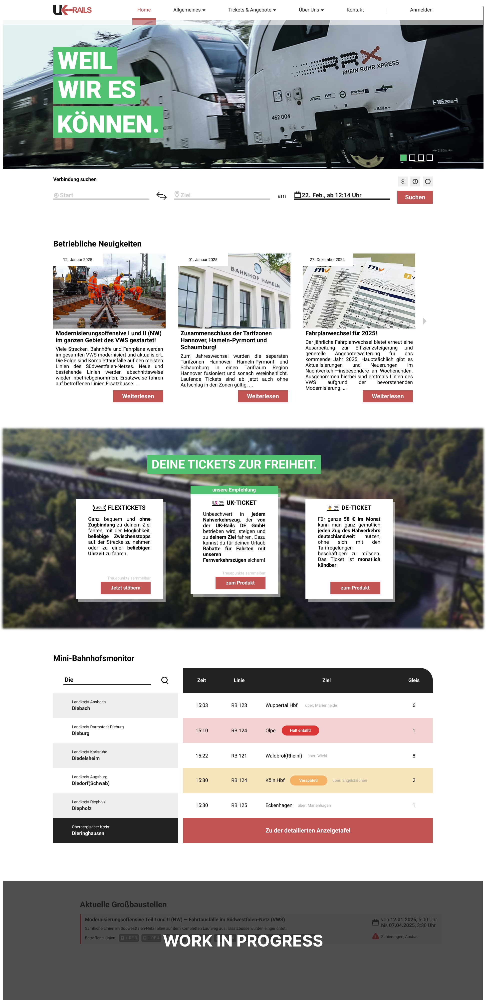

# ukrails
Momentan ist das hier eine (unvollständige) Sammlung von verschiedenen Dokumenten bezüglich dieses Projekts und beinhaltet:
- eine statisch programmierte Webseite (dienend als Konzept/Idee) mittels HTML/CSS, die die nächsten Abfahrten eines Bahnhofs zeigt (→ https://iamjustinuk.github.io/ukrails-monitor/),
- ein unvollständiges, mit Figma erstelltes Design bzgl. der Landing Page und
- ein fünfseitiges Dokument (hier in einzelnen Seiten hochgeladen) zu den Auswirkungen einer fiktionalen Baustelle und den geplanten Änderungen im Betrieb (→ plakatinfo).

Nach und nach, wenn Studium und Job es zulassen :), soll das Portfolio-Projekt an Struktur gewinnen.

## Landing Page (nicht fertig)

